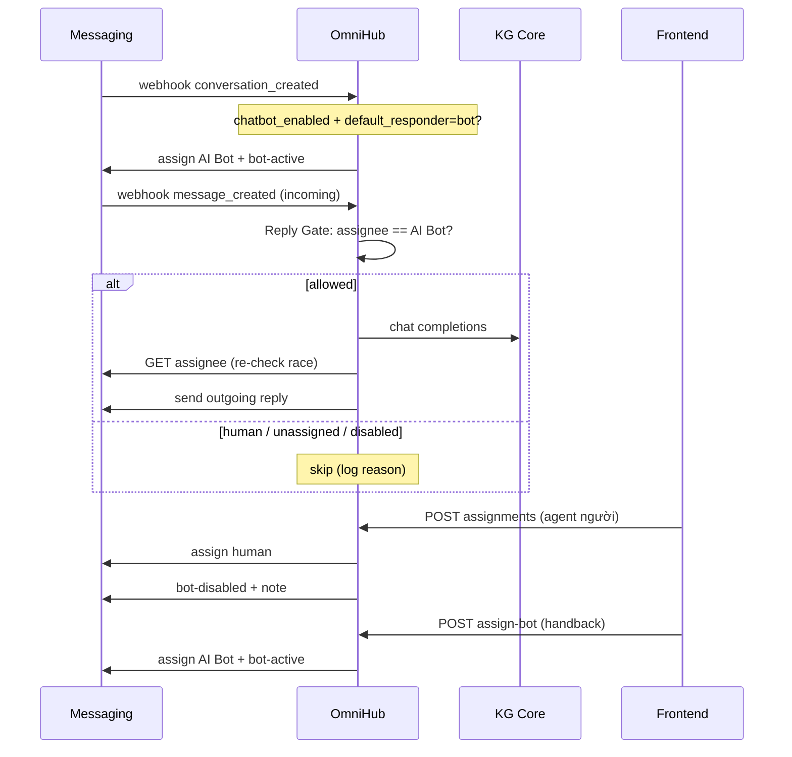

# AI Bot: assign mặc định & handover (OmniHub)

Tài liệu cho **Frontend** và **dev** sau này. Mô tả luồng bot tư vấn mặc định, takeover người, handback về bot, và cách tránh double tin khi có thêm tích hợp.

**Nguồn sự thật:** `assignee` trên messaging (Chatwoot).  
**Ai trả lời AI:** chỉ OmniHub → KG Core (qua Reply Gate), không Automation gửi tin song song.

---

## 1. Hành vi product

| Tình huống | Assignee | Bot KG trả lời? |
|------------|----------|-----------------|
| Conversation mới + tenant `chatbot_enabled` + `default_responder=bot` | **AI Bot** (auto) | Có |
| Agent người assign / self-assign | Agent đó | **Không** |
| Bấm “Giao lại cho bot” (handback) | AI Bot | Có (tin sau đó) |
| `chatbot_enabled=false` | Không auto-as bot | Không |
| `default_responder=agent` | Không auto-as bot | Không (trừ khi đã as AI Bot thủ công) |
| Unassigned | — | **Không** |

Label `bot-active` / `bot-disabled` và `custom_attributes.is_bot_active` chỉ **phụ trợ UI** — **không** được phép thắng khi assignee đã là người.

---

## 2. Config theo tenant (multi-customer)

**Không** phụ thuộc một id Chatwoot trong `.env` cho mọi khách.  
Mỗi tenant gắn **UUID agent nội bộ** qua list `messaging_bots` (có thể rỗng).

| Key | Nơi | Ý nghĩa |
|-----|-----|---------|
| `messaging_bots` | `tenant.meta_data` | **Nguồn sự thật duy nhất.** `[]` = không dùng AI Bot; có phần tử = bot(s). Shape: `{ key, agent_uuid, is_default, label }` |
| `chatbot_enabled` | `tenant.meta_data` | Kill-switch toàn tenant |
| `default_responder` | `bot` \| `agent` | Auto-assign bot khi conversation mới (chỉ khi có bot `is_default`) |

Tenant mới mặc định:

```json
{
  "chatbot_enabled": true,
  "default_responder": "agent",
  "messaging_bots": []
}
```

Bật bot: PATCH `messaging_bots` với ≥1 entry (`is_default: true`) và thường set `default_responder: "bot"`.

Runtime:

```text
messaging_bots[].agent_uuid  →  map AGENT (tenant) / USER
                             →  chatwoot_id
                             →  assign / is_bot_assignee
```

**Idempotency reply:** Redis key `bot:kg_reply:{account_id}:{message_id}` (SET NX, TTL 48h). Webhook `message_created` trùng → skip; `kg_empty` / `send_failed` nhả claim để retry.

Thêm bot sau này: thêm phần tử vào `messaging_bots`. Chỉ **một** `is_default=true` dùng cho auto-assign / `assign-bot`.

API settings:

- `GET/PATCH /api/v1/tenants/me/settings`

**Ops:** Tắt Chatwoot Automation “Assign AI Bot” khi OmniHub đã cover (tránh hai nguồn).

---

## 3. Flow tổng quan



---

## 4. API Frontend cần dùng

Base: `/api/v1` + JWT. Permission assign: `assign_messaging_conversation`.

### 4.1 Takeover — giao cho người (bot tắt)

```http
POST /api/v1/messaging/tenants/{tenant_id}/conversations/{conversation_id}/assignments
```

Body (ví dụ):

```json
{
  "assignee_agent_uuid": "<uuid agent nội bộ>"
}
```

Sau thành công backend **tự**:

- Gọi messaging assign
- Set `is_bot_active=false`, label `bot-disabled`
- Internal note: nhân viên tiếp nhận, bot tạm dừng

FE **không** cần gọi thêm API tắt bot.

### 4.2 Handback — giao lại AI Bot (bot bật)

```http
POST /api/v1/messaging/tenants/{tenant_id}/conversations/{conversation_id}/assign-bot
```

Body: không cần. Backend as **default bot của tenant** (`messaging_bots` phần tử `is_default`).

Tin khách **sau** đó bot mới reply.

### 4.3 Settings — chọn agent làm bot (UUID map)

```http
GET  /api/v1/tenants/me/settings
PATCH /api/v1/tenants/me/settings
```

FE lấy UUID từ `GET /api/v1/messaging/tenants/{tenant_id}/agents` (không nhập id Chatwoot).

**Không dùng bot** (mặc định / tắt bot list):

```json
{
  "chatbot_enabled": true,
  "default_responder": "agent",
  "messaging_bots": []
}
```

**1 bot mặc định:**

```json
{
  "chatbot_enabled": true,
  "default_responder": "bot",
  "messaging_bots": [
    {
      "key": "default",
      "agent_uuid": "019fa67b-800a-7086-bbe3-946f16dfdc5c",
      "is_default": true,
      "label": "AI Bot"
    }
  ]
}
```

**Nhiều bot (mở rộng sau):**

```json
{
  "messaging_bots": [
    {
      "key": "default",
      "agent_uuid": "019fa67b-800a-7086-bbe3-946f16dfdc5c",
      "is_default": true,
      "label": "AI Bot chính"
    },
    {
      "key": "sales",
      "agent_uuid": "019fa67b-aaaa-bbbb-cccc-946f16dfdc5c",
      "is_default": false,
      "label": "Bot sales"
    }
  ]
}
```

- Mọi `agent_uuid` trong list đều được coi là bot (KG reply khi conversation as agent đó).  
- Auto-assign / `assign-bot` chỉ dùng `is_default`.  
- UUID phải đã có map — nếu thiếu API trả 400.

---

## 5. UI / state gợi ý cho FE

| Dữ liệu messaging | Hiển thị |
|-------------------|----------|
| `assignee.id` == AI Bot (hoặc label `bot-active` + assignee bot) | Badge **AI Bot đang tư vấn** |
| `assignee` = agent người | Badge **Agent: {name}** + nút “Giao lại cho bot” |
| `bot-disabled` / `is_bot_active=false` | Bot đã tắt (vẫn tin assignee) |

Nút:

- **Tiếp nhận / Gán nhân viên** → `POST .../assignments`
- **Giao lại cho bot** → `POST .../assign-bot`

Socket `messaging_event` (`conversation_updated`, `message_created`) để cập nhật assignee realtime (xem `docs/frontend_integration.md`).

---

## 6. Rule backend (dev)

File chính: `app/services/v1/handle_chatwoot/chatbot.py`

| Hàm | Vai trò |
|-----|---------|
| `parse_tenant_messaging_bots` / `default_bot_agent_uuid` | Đọc `messaging_bots` (có thể `[]`) |
| `normalize_messaging_bots_meta` | Đảm bảo có list; migrate shorthand legacy → list; xóa key cũ |
| `resolve_tenant_bot_chatwoot_ids` | UUID → chatwoot id (map); **không** fallback env |
| `resolve_default_bot_chatwoot_id` | Default bot chatwoot id; `None` nếu list rỗng |
| `is_bot_assignee(db, tenant, id)` | Assignee có thuộc bot của tenant? |
| `should_bot_respond` | `(bool, reason)` — assignee là nguồn sự thật |
| `maybe_auto_assign_ai_bot` | `conversation_created` (+ tin đầu nếu unassigned) |
| `claim_and_reply_omnihub_kg` | Reply Gate + idempotency theo `message_id` |
| `assign_to_ai_bot` | Assign default bot của tenant |

Thứ tự `should_bot_respond`: tenant policy → soft disable → assignee ∈ bot ids tenant → true.

---

## 7. Chống double tin & tích hợp sau này

### Hiện tại

- Chỉ OmniHub KG gửi tin bot qua `claim_and_reply_omnihub_kg`
- **Idempotency:** Redis `bot:kg_reply:{account_id}:{message_id}` — webhook trùng không gọi KG / không gửi lại
- Assign AI Bot **không** tự gửi welcome (tránh 2 tin với KG)
- Tắt Automation Chatwoot assign/send bot
- Tenant **bắt buộc** config bot UUID — không dùng chung id từ `.env`

### Sau này thêm AI / AgentBot / vendor

1. Cùng lúc **một** `allowed_replier` (vd `omnihub_kg` | `external:x`)  
2. Mọi đường gửi tin bot **đi qua Reply Gate** (cùng pattern `claim_and_reply_*`)  
3. Không để tích hợp POST message thẳng lên Chatwoot khi không được cấp quyền  
4. Takeover người → `allowed_replier=none` → mọi bot/integration im  

---

## 8. Checklist test

1. Tenant bật bot + `default_responder=bot` → chat mới → assignee AI Bot → bot trả lời.  
2. Assign / self-assign người → note tắt bot → khách nhắn → **không** còn tin bot.  
3. `POST assign-bot` → assignee AI Bot → khách nhắn → bot trả lời lại.  
4. `chatbot_enabled=false` → không auto-as, không reply.  
5. `default_responder=agent` → không auto-as bot.  
6. (Ops) Tắt Automation — vẫn đủ luồng 1–3.

---

## 9. Troubleshooting

| Hiện tượng | Kiểm tra |
|------------|----------|
| Không auto-as / không reply | `messaging_bots` có bot `is_default`? Agent đã map? Log `missing_tenant_bot_agent_uuid` / `human_assignee` |
| As “AI Bot” trên Chatwoot nhưng OmniHub im | UUID trong `messaging_bots` phải map đúng chatwoot id (không tin tên Automation); không còn fallback env |
| Handback 400 | Gọi GET agents rồi PATCH settings với UUID |
| 2 tin chào | Tắt Automation / AgentBot native đang send song song |
| Webhook trùng / retry | Log `reason=duplicate_message` — bình thường, đã claim Redis |

Log skip reply: `Bot skip reply conv=... reason=...` (`human_assignee`, `unassigned`, `bot_flag_disabled`, `duplicate_message`, …).
